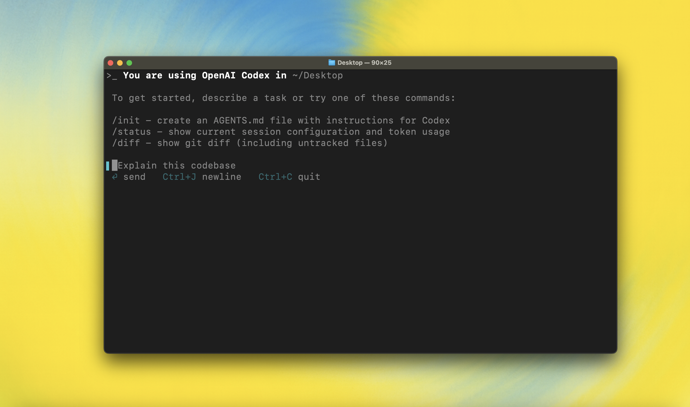

<h1 align="center">Hanzo Dev CLI</h1>

<p align="center"><code>npm i -g @hanzo/dev</code><br />or <code>pip install hanzo-dev</code></p>

<p align="center"><strong>Hanzo Dev</strong> is an AI-powered coding agent that runs locally on your computer, based on OpenAI Codex with GPT-5 readiness.
</br>
</br>Built by <a href="https://hanzo.ai">Hanzo AI</a> - Advanced AI infrastructure and tooling
</br>If you want Hanzo Dev in your code editor (VS Code, Cursor, Windsurf), <a href="https://github.com/hanzoai/dev-ide">install in your IDE</a>
</br>For the cloud-based version, visit <a href="https://hanzo.ai/dev">hanzo.ai/dev</a></p>

<p align="center">
  
  </p>

---

## Quickstart

### Installing and running Codex CLI

Install globally with your preferred package manager. If you use npm:

```shell
npm install -g @hanzo/dev
```

Alternatively, if you use pip:

```shell
pip install hanzo-dev
```

Then simply run `hanzo` to get started:

```shell
hanzo
```

<details>
<summary>You can also go to the <a href="https://github.com/openai/codex/releases/latest">latest GitHub Release</a> and download the appropriate binary for your platform.</summary>

Each GitHub Release contains many executables, but in practice, you likely want one of these:

- macOS
  - Apple Silicon/arm64: `codex-aarch64-apple-darwin.tar.gz`
  - x86_64 (older Mac hardware): `codex-x86_64-apple-darwin.tar.gz`
- Linux
  - x86_64: `codex-x86_64-unknown-linux-musl.tar.gz`
  - arm64: `codex-aarch64-unknown-linux-musl.tar.gz`

Each archive contains a single entry with the platform baked into the name (e.g., `codex-x86_64-unknown-linux-musl`), so you likely want to rename it to `codex` after extracting it.

</details>

### Using Hanzo Dev with your AI provider

<p align="center">
  
  </p>

Run `hanzo` and select **Sign in with your AI provider**. Hanzo Dev supports multiple AI providers including OpenAI (GPT-5 ready), Anthropic Claude, and local models. You can sign in with your ChatGPT account to use as part of your Plus, Pro, Team, Edu, or Enterprise plan.

You can also use Hanzo Dev with an API key from any supported provider. See [authentication documentation](./docs/authentication.md) for setup details. If you're having trouble with login, please visit [our support](https://github.com/hanzoai/dev/issues).

### Model Context Protocol (MCP)

Hanzo Dev supports [MCP servers](./docs/advanced.md#model-context-protocol-mcp) with enhanced capabilities. Enable by adding an `mcp_servers` section to your `~/.hanzo/config.toml`.


### Configuration

Hanzo Dev supports a rich set of configuration options, with preferences stored in `~/.hanzo/config.toml`. For full configuration options, see [Configuration](./docs/config.md).

---

### Docs & FAQ

- [**Getting started**](./docs/getting-started.md)
  - [CLI usage](./docs/getting-started.md#cli-usage)
  - [Running with a prompt as input](./docs/getting-started.md#running-with-a-prompt-as-input)
  - [Example prompts](./docs/getting-started.md#example-prompts)
  - [Memory with AGENTS.md](./docs/getting-started.md#memory-with-agentsmd)
  - [Configuration](./docs/config.md)
- [**Sandbox & approvals**](./docs/sandbox.md)
- [**Authentication**](./docs/authentication.md)
  - [Auth methods](./docs/authentication.md#forcing-a-specific-auth-method-advanced)
  - [Login on a "Headless" machine](./docs/authentication.md#connecting-on-a-headless-machine)
- [**Advanced**](./docs/advanced.md)
  - [Non-interactive / CI mode](./docs/advanced.md#non-interactive--ci-mode)
  - [Tracing / verbose logging](./docs/advanced.md#tracing--verbose-logging)
  - [Model Context Protocol (MCP)](./docs/advanced.md#model-context-protocol-mcp)
- [**Zero data retention (ZDR)**](./docs/zdr.md)
- [**Contributing**](./docs/contributing.md)
- [**Install & build**](./docs/install.md)
  - [System Requirements](./docs/install.md#system-requirements)
  - [DotSlash](./docs/install.md#dotslash)
  - [Build from source](./docs/install.md#build-from-source)
- [**FAQ**](./docs/faq.md)
- [**Open source fund**](./docs/open-source-fund.md)

---

## License

This repository is licensed under the [Apache-2.0 License](LICENSE).

