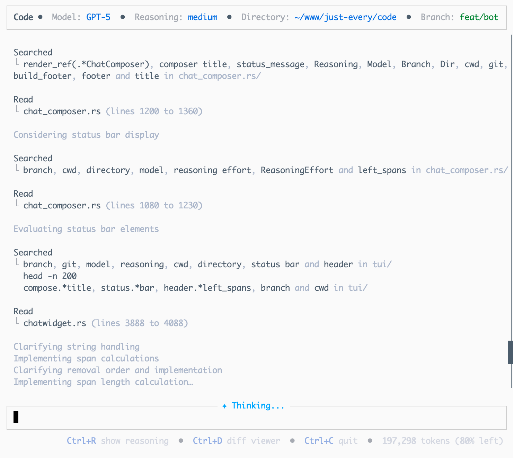
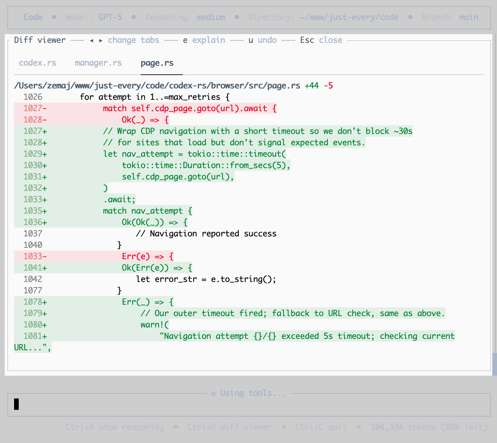
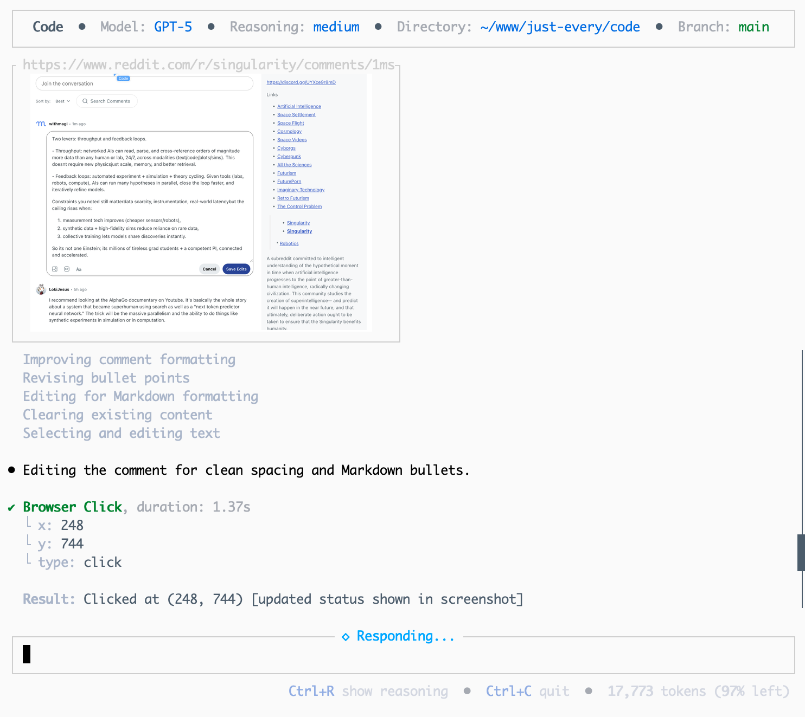
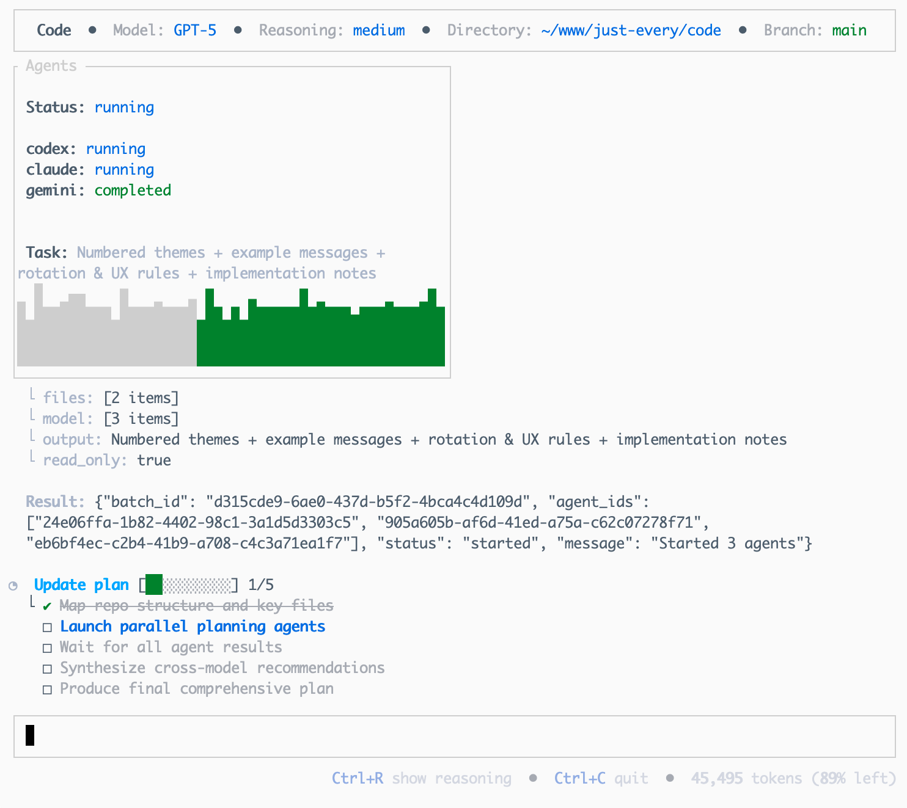

<h1 align="center">Hanzo Dev CLI</h1>

<p align="center"><code>npm i -g @hanzo/dev</code><br />or <code>pip install hanzo-dev</code></p>

<p align="center"><strong>Hanzo Dev</strong> is an AI-powered coding agent that runs locally on your computer, based on OpenAI Codex with GPT-5 readiness.
</br>
</br>Built by <a href="https://hanzo.ai">Hanzo AI</a> - Advanced AI infrastructure and tooling
</br>If you want Hanzo Dev in your code editor (VS Code, Cursor, Windsurf), <a href="https://github.com/hanzoai/dev-ide">install in your IDE</a>
</br>For the cloud-based version, visit <a href="https://hanzo.ai/dev">hanzo.ai/dev</a></p>

<p align="center">
  
  </p>

---

**Hanzo Dev** is a fast, local coding agent for your terminal. It's based on the open-source Codex project with Hanzo-specific enhancements focused on real developer ergonomics: Browser integration, multi-agents, theming, and reasoning control.

&ensp;
## Why Hanzo Dev

  - 🌐 **Browser Integration** - CDP support, headless browsing, screenshots
  - 📝 **Diff Viewer** - Side-by-side diffs with syntax highlighting
  - 🤖 **Multi-Agent Commands** - /plan, /solve, /code with agent panels
  - 🎨 **Theme System** - /themes with live preview and accessibility
  - 🧠 **Reasoning Control** - /reasoning for dynamic effort adjustment
  - 🔌 **MCP support** – Extend with filesystem, DBs, APIs, or your own tools.
  - 🔒 **Safety modes** – Read-only, approvals, and workspace sandboxing.
  - 🚀 **Hanzo AI Integration** - Enhanced with Hanzo's AI infrastructure

&ensp;
| <br>Simple interface | <br>Unified diffs |
|:--:|:--:|

| <br><br>Browser control | <br><br>Assist with Claude & Gemini |
|:--:|:--:|


&ensp;
## Quickstart

### Installing and running Codex CLI

<<<<<<< HEAD
Install globally with your preferred package manager. If you use npm:
=======
```bash
npx -y @just-every/code
```

### Install & Run

```bash
npm install -g @just-every/code
code // or `coder` if you're using VS Code
```

Note: If another tool already provides a `code` command (e.g. VS Code), our CLI is also installed as `coder`. Use `coder` to avoid conflicts.

**Authenticate** (one of the following):
- **Sign in with ChatGPT** (Plus/Pro/Team; uses models available to your plan)
  - Run `code` and pick "Sign in with ChatGPT"
  - Stores creds locally at `~/.code/auth.json` (still reads legacy `~/.codex/auth.json` if present)
- **API key** (usage-based)
  - Set `export OPENAI_API_KEY=xyz` and run `code`

### Install Claude & Gemini (optional)

Code supports orchestrating other AI CLI tools. Install these and config to use alongside Code.

```bash

npm install -g @anthropic-ai/claude-code @google/gemini-cli && claude "Just checking you're working! Let me know how I can exit." && gemini -i "Just checking you're working! Let me know how I can exit."
```

&ensp;
## Commands

### Browser
```bash
# Connect code to external Chrome browser (running CDP)
/chrome        # Connect with auto-detect port
/chrome 9222   # Connect to specific port

# Switch to internal browser mode
/browser       # Use internal headless browser
/browser https://example.com  # Open URL in internal browser
```

### Agents
```bash
# Plan code changes (Claude, Gemini and GPT-5 consensus)
# All agents review task and create a consolidated plan
/plan "Stop the AI from ordering pizza at 3AM"

# Solve complex problems (Claude, Gemini and GPT-5 race)
# Fastest preferred (see https://arxiv.org/abs/2505.17813)
/solve "Why does deleting one user drop the whole database?"

# Write code! (Claude, Gemini and GPT-5 consensus)
# Creates multiple worktrees then implements the optimal solution
/code "Show dark mode when I feel cranky"
```

### General
```bash
# Try a new theme!
/themes

# Change reasoning level
/reasoning low|medium|high

# Switch models or effort presets
/model

# Start new conversation
/new
```

## CLI reference
>>>>>>> just-every/main

```shell
npm install -g @hanzo/dev
```

Alternatively, if you use pip:

```shell
pip install hanzo-dev
```

Then simply run `hanzo` to get started:

<<<<<<< HEAD
```shell
hanzo
=======
Code supports MCP for extended capabilities:

- **File operations**: Advanced file system access
- **Database connections**: Query and modify databases
- **API integrations**: Connect to external services
- **Custom tools**: Build your own extensions

Configure MCP in `~/.code/config.toml` (legacy `~/.codex/config.toml` is still read if present). Define each server under a named table like `[mcp_servers.<name>]` (this maps to the JSON `mcpServers` object used by other clients):

```toml
[mcp_servers.filesystem]
command = "npx"
args = ["-y", "@modelcontextprotocol/server-filesystem", "/path/to/project"]
>>>>>>> just-every/main
```

<details>
<summary>You can also go to the <a href="https://github.com/openai/codex/releases/latest">latest GitHub Release</a> and download the appropriate binary for your platform.</summary>

<<<<<<< HEAD
Each GitHub Release contains many executables, but in practice, you likely want one of these:
=======
Main config file: `~/.code/config.toml`

> [!NOTE]
> Code reads from both `~/.code/` and `~/.codex/` for backwards compatibility, but it only writes updates to `~/.code/`. If you switch back to Codex and it fails to start, remove `~/.codex/config.toml`. If Code appears to miss settings after upgrading, copy your legacy `~/.codex/config.toml` into `~/.code/`.
>>>>>>> just-every/main

- macOS
  - Apple Silicon/arm64: `codex-aarch64-apple-darwin.tar.gz`
  - x86_64 (older Mac hardware): `codex-x86_64-apple-darwin.tar.gz`
- Linux
  - x86_64: `codex-x86_64-unknown-linux-musl.tar.gz`
  - arm64: `codex-aarch64-unknown-linux-musl.tar.gz`

Each archive contains a single entry with the platform baked into the name (e.g., `codex-x86_64-unknown-linux-musl`), so you likely want to rename it to `codex` after extracting it.

</details>

### Using Hanzo Dev with your AI provider

<p align="center">
  
  </p>

Run `hanzo` and select **Sign in with your AI provider**. Hanzo Dev supports multiple AI providers including OpenAI (GPT-5 ready), Anthropic Claude, and local models. You can sign in with your ChatGPT account to use as part of your Plus, Pro, Team, Edu, or Enterprise plan.

You can also use Hanzo Dev with an API key from any supported provider. See [authentication documentation](./docs/authentication.md) for setup details. If you're having trouble with login, please visit [our support](https://github.com/hanzoai/dev/issues).

### Model Context Protocol (MCP)

<<<<<<< HEAD
Hanzo Dev supports [MCP servers](./docs/advanced.md#model-context-protocol-mcp) with enhanced capabilities. Enable by adding an `mcp_servers` section to your `~/.hanzo/config.toml`.
=======
**Can I use my existing Codex configuration?**
> Yes. Code reads from both `~/.code/` (primary) and legacy `~/.codex/` directories. We only write to `~/.code/`, so Codex will keep running if you switch back; copy or remove legacy files if you notice conflicts.

**Does this work with ChatGPT Plus?**
> Absolutely. Use the same "Sign in with ChatGPT" flow as the original.

**Is my data secure?**
> Yes. Authentication stays on your machine, and we don't proxy your credentials or conversations.

&ensp;
## Contributing

We welcome contributions! This fork maintains compatibility with upstream while adding community-requested features.

### Development workflow

```bash
# Clone and setup
git clone https://github.com/just-every/code.git
cd code
npm install

# Build (use fast build for development)
./build-fast.sh

# Run locally
./codex-rs/target/dev-fast/code
```

### Opening a pull request

1. Fork the repository
2. Create a feature branch: `git checkout -b feature/amazing-feature`
3. Make your changes
4. Run tests: `cargo test`
5. Build successfully: `./build-fast.sh`
6. Submit a pull request
>>>>>>> just-every/main


### Configuration

Hanzo Dev supports a rich set of configuration options, with preferences stored in `~/.hanzo/config.toml`. For full configuration options, see [Configuration](./docs/config.md).

---

<<<<<<< HEAD
### Docs & FAQ
=======
### Privacy
- Your auth file lives at `~/.code/auth.json` (legacy `~/.codex/auth.json` is still read).
- Inputs/outputs you send to AI providers are handled under their Terms and Privacy Policy; consult those documents (and any org-level data-sharing settings).
>>>>>>> just-every/main

- [**Getting started**](./docs/getting-started.md)
  - [CLI usage](./docs/getting-started.md#cli-usage)
  - [Running with a prompt as input](./docs/getting-started.md#running-with-a-prompt-as-input)
  - [Example prompts](./docs/getting-started.md#example-prompts)
  - [Memory with AGENTS.md](./docs/getting-started.md#memory-with-agentsmd)
  - [Configuration](./docs/config.md)
- [**Sandbox & approvals**](./docs/sandbox.md)
- [**Authentication**](./docs/authentication.md)
  - [Auth methods](./docs/authentication.md#forcing-a-specific-auth-method-advanced)
  - [Login on a "Headless" machine](./docs/authentication.md#connecting-on-a-headless-machine)
- [**Advanced**](./docs/advanced.md)
  - [Non-interactive / CI mode](./docs/advanced.md#non-interactive--ci-mode)
  - [Tracing / verbose logging](./docs/advanced.md#tracing--verbose-logging)
  - [Model Context Protocol (MCP)](./docs/advanced.md#model-context-protocol-mcp)
- [**Zero data retention (ZDR)**](./docs/zdr.md)
- [**Contributing**](./docs/contributing.md)
- [**Install & build**](./docs/install.md)
  - [System Requirements](./docs/install.md#system-requirements)
  - [DotSlash](./docs/install.md#dotslash)
  - [Build from source](./docs/install.md#build-from-source)
- [**FAQ**](./docs/faq.md)
- [**Open source fund**](./docs/open-source-fund.md)

---

## License

This repository is licensed under the [Apache-2.0 License](LICENSE).

