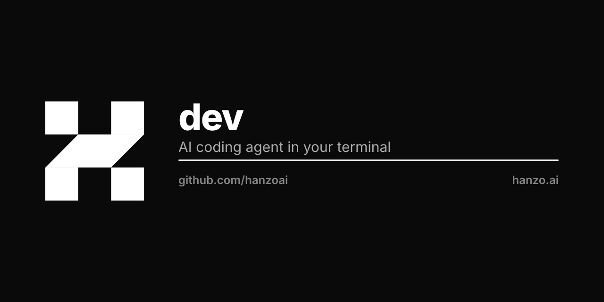

<p align="center"></p>

# Hanzo Dev

**Fast, local AI coding agent for your terminal — written in Rust.**

[](https://www.npmjs.com/package/@hanzo/dev)
[](LICENSE)
[](https://www.rust-lang.org)

**Hanzo Dev** (`dev` for short) is a fast, local coding agent that lives in your terminal. It is a community-driven fork of [`just-every/code`](https://github.com/just-every/code) (itself a fork of [`openai/codex`](https://github.com/openai/codex)), rebuilt around real developer ergonomics — browser integration, multi-agent orchestration, theming, and reasoning control — while staying compatible with upstream and defaulting to **Hanzo AI, the Open AI Cloud**.

&ensp;

## What's new

- **Long-session stability** — Auto Drive and Auto Review are fully decoupled: background reviews never block the command flow. `Esc` returns control immediately, and you can keep typing while a review finalizes.
- **Bounded by design** — core, coordinator, and TUI state maps, Auto Drive conversation/update queues, and prompt/agent/runtime caches all have hard caps with deterministic drop/trim, so long runs stay memory-stable. Terminal agents are compacted and archived while review linkage is preserved.
- **Non-blocking reviews** — Auto Review runs in a separate worktree on every code-changing turn and posts findings (plus ready-to-apply fixes) as history-visible notes instead of foreground task injection. Review metadata (branch/worktree context) stays queryable through the active Auto Drive session after completion.
- **Auto Drive orchestration** — hand off a multi-step task and a coordinator drives agents and approvals to a complete result, with `medium | high | xhigh` reasoning controls and bounded decision history that preserves goal and recent context.
- **Quality-first** — the emphasis is "did we verify it works," not just "can the model write the file." Stress tests cover heavy agent churn plus concurrent Auto Review + `Esc`/typing responsiveness.

&ensp;

## Why Hanzo Dev

- **Auto Drive orchestration** — multi-agent automation that self-heals and ships complete tasks.
- **Browser integration** — CDP support, headless browsing, screenshots captured inline.
- **Multi-agent commands** — `/plan`, `/code`, and `/solve` coordinate multiple CLI agents.
- **Unified settings hub** — `/settings` overlay for limits, theming, approvals, and provider wiring.
- **Theme system** — switch between accessible presets, customize accents, and preview live via `/themes`.
- **MCP support** — extend with filesystem, databases, APIs, or your own tools.
- **Safety modes** — read-only, approvals, and workspace sandboxing.

&ensp;

## Quickstart

### Run

```bash
npx -y @hanzo/dev
```

### Install & run

```bash
npm install -g @hanzo/dev
dev
```

> If another tool already provides a `code` command (e.g. VS Code), the CLI is also installed as `coder`. Use `coder` to avoid conflicts.

**Authenticate** (one of the following):

- **Hanzo** (default) — sign in to Hanzo IAM ([hanzo.id](https://hanzo.id)) or set `export HANZO_API_KEY=xyz`, then run `dev`. Requests route to **Hanzo AI (the Open AI Cloud)** at `https://api.hanzo.ai/v1`, where the Zen model family and 100+ third-party models are served through one API.
- **Sign in with ChatGPT** (Plus/Pro/Team; uses models available to your plan) — run `dev` and pick "Sign in with ChatGPT".
- **OpenAI API key** (usage-based) — set `export OPENAI_API_KEY=xyz` and run `dev`.

### Install Claude & Gemini (optional)

Hanzo Dev can orchestrate other AI CLI tools. Install these to use them alongside Dev.

```bash
# Ensure Node.js 20+ is available locally (installs into ~/.n)
npm install -g n
export N_PREFIX="$HOME/.n"
export PATH="$N_PREFIX/bin:$PATH"
n 20.18.1

# Install the companion CLIs
export npm_config_prefix="${npm_config_prefix:-$HOME/.npm-global}"
mkdir -p "$npm_config_prefix/bin"
export PATH="$npm_config_prefix/bin:$PATH"
npm install -g @anthropic-ai/claude-code @google/gemini-cli @qwen-code/qwen-code

# Quick smoke tests
claude --version
gemini --version
qwen --version
```

> Add `export N_PREFIX="$HOME/.n"` and `export PATH="$N_PREFIX/bin:$PATH"` (plus the `npm_config_prefix` bin path) to your shell profile so the CLIs stay on `PATH` in future sessions.

&ensp;

## Commands

### Browser

```bash
# Connect Dev to an external Chrome browser (running CDP)
/chrome        # Connect with auto-detect port
/chrome 9222   # Connect to a specific port

# Switch to internal browser mode
/browser       # Use internal headless browser
/browser https://example.com  # Open a URL in the internal browser
```

### Agents

```bash
# Plan code changes (multi-model consensus)
# All agents review the task and create a consolidated plan
/plan "Stop the AI from ordering pizza at 3AM"

# Solve complex problems (multi-model race)
# Fastest preferred (see https://arxiv.org/abs/2505.17813)
/solve "Why does deleting one user drop the whole database?"

# Write code! (multi-model consensus)
# Creates multiple worktrees, then implements the optimal solution
/code "Show dark mode when I feel cranky"
```

### Auto Drive

```bash
# Hand off a multi-step task; Auto Drive coordinates agents and approvals
/auto "Refactor the auth flow and add device login"

# Resume or inspect an active Auto Drive run
/auto status
```

### General

```bash
/themes                    # Try a new theme
/reasoning low|medium|high # Change reasoning level
/model                     # Switch models or effort presets
/new                       # Start a new conversation
```

## CLI reference

```shell
dev [options] [prompt]

Options:
  --model <name>        Override the model for the active provider (e.g. a Zen
                        model, or any model your provider serves)
  --read-only           Prevent file modifications
  --no-approval         Skip approval prompts (use with caution)
  --config <key=val>    Override config values
  --oss                 Use local open source models
  --sandbox <mode>      Set sandbox level (read-only, workspace-write, etc.)
  --help                Show help information
  --debug               Log API requests and responses to file
  --version             Show version number
```

> `--model` only changes the model name sent to the active provider. To use a different provider, set `model_provider` in `config.toml`. Providers must expose an OpenAI-compatible API (Chat Completions or Responses).

&ensp;

## Memory & project docs

Hanzo Dev remembers context across sessions:

1. **Create an `AGENTS.md` or `CLAUDE.md` file** in your project root:

   ```markdown
   # Project Context

   This is a React TypeScript application with:

   - Authentication via JWT
   - PostgreSQL database
   - Express.js backend

   ## Key files:

   - `/src/auth/` - Authentication logic
   - `/src/api/` - API client code
   - `/server/` - Backend services
   ```

2. **Session memory** — Hanzo Dev maintains conversation history.
3. **Codebase analysis** — it automatically understands project structure.

&ensp;

## Non-interactive / CI mode

For automation and CI/CD:

```shell
# Run a specific task
dev --no-approval "run tests and fix any failures"

# Generate reports
dev --read-only "analyze code quality and generate report"

# Batch processing
dev --config output_format=json "list all TODO comments"
```

&ensp;

## Model Context Protocol (MCP)

Hanzo Dev supports MCP for extended capabilities:

- **File operations** — advanced file system access
- **Database connections** — query and modify databases
- **API integrations** — connect to external services
- **Custom tools** — build your own extensions

Configure MCP in `config.toml`. Define each server under a named table like `[mcp_servers.<name>]` (this maps to the JSON `mcpServers` object used by other clients):

```toml
[mcp_servers.filesystem]
command = "npx"
args = ["-y", "@modelcontextprotocol/server-filesystem", "/path/to/project"]
```

&ensp;

## Configuration

Main config file: `config.toml` in the Dev config home (`$CODEX_HOME`, defaulting to `~/.codex`; legacy `~/.code` is also read).

```toml
# Model settings — Hanzo serves the Zen model family via api.hanzo.ai/v1
model = "zen-coder"
model_provider = "hanzo"

# Behavior
approval_policy = "on-request"     # untrusted | on-failure | on-request | never
model_reasoning_effort = "medium"  # low | medium | high
sandbox_mode = "workspace-write"

# UI preferences — see THEME_CONFIG.md
[tui.theme]
name = "light-photon"

# Add config for specific providers/models
[profiles.gpt-5]
model = "gpt-5.1"
model_provider = "openai"
approval_policy = "never"
model_reasoning_effort = "high"
model_reasoning_summary = "detailed"
```

### Environment variables

- `HANZO_API_KEY` — Hanzo IAM API key for the default Hanzo AI provider
- `HANZO_NODE_URL` — override the local Hanzo node provider base URL
- `CODEX_HOME` — override config directory location
- `OPENAI_API_KEY` — use an OpenAI API key instead of Hanzo/ChatGPT auth
- `OPENAI_BASE_URL` — use OpenAI-compatible API endpoints (chat or responses)
- `OPENAI_WIRE_API` — force the built-in OpenAI provider to use `chat` or `responses` wiring

&ensp;

## FAQ

**How is this different from upstream?**

> This fork defaults to **Hanzo AI (the Open AI Cloud)** and Hanzo IAM auth, and adds browser integration, multi-agent commands (`/plan`, `/solve`, `/code`), Auto Drive orchestration, a theme system, and enhanced reasoning controls — while maintaining full compatibility with `openai/codex`.

**Can I use my existing Codex configuration?**

> Yes. Hanzo Dev reads the standard config home (`$CODEX_HOME`, default `~/.codex`) plus legacy `~/.code`, so existing configuration keeps working.

**Does this work with ChatGPT Plus?**

> Yes. Use the "Sign in with ChatGPT" flow.

**Is my data secure?**

> Authentication stays on your machine; credentials and conversations are not proxied by this CLI.

&ensp;

## Contributing

Contributions are welcome. Hanzo Dev maintains compatibility with upstream while adding community-requested features.

### Development workflow

```bash
# Clone and set up
git clone https://github.com/hanzoai/dev.git
cd dev
npm install

# Build (use the fast build for development)
./build-fast.sh

# Run locally
cargo run --manifest-path codex-rs/Cargo.toml -p codex-cli --bin dev
```

#### Git hooks

This repo ships shared hooks under `.githooks/`. Enable them locally:

```bash
git config core.hooksPath .githooks
```

The `pre-push` hook runs `./pre-release.sh` automatically when pushing to `main`.

### Opening a pull request

1. Fork the repository.
2. Create a feature branch: `git checkout -b feature/amazing-feature`.
3. Make your changes.
4. Run tests: `cargo test`.
5. Build successfully: `./build-fast.sh`.
6. Submit a pull request.

&ensp;

## Legal & use

### License & attribution

- This project is a community fork of [`just-every/code`](https://github.com/just-every/code), itself a fork of [`openai/codex`](https://github.com/openai/codex), under **Apache-2.0**. We preserve the upstream LICENSE and NOTICE files.
- **Hanzo Dev** is **not** affiliated with, sponsored by, or endorsed by OpenAI.

### Your responsibilities

Using Hanzo, OpenAI, Anthropic, or Google services through Hanzo Dev means you agree to **their terms and policies**. In particular:

- **Don't** programmatically scrape/extract content outside intended flows.
- **Don't** bypass or interfere with rate limits, quotas, or safety mitigations.
- Use your **own** account; don't share or rotate accounts to evade limits.
- If you configure other model providers, you're responsible for their terms.

### Privacy

- Your auth file lives in the Dev config home (`$CODEX_HOME`, default `~/.codex`).
- Inputs/outputs you send to AI providers are handled under their terms and privacy policy; consult those documents (and any org-level data-sharing settings).

### Subject to change

AI providers can change eligibility, limits, models, or authentication flows. Hanzo Dev supports Hanzo IAM, ChatGPT sign-in, and API-key modes so you can pick what fits (local/hobby vs CI/automation).

&ensp;

## License

Apache-2.0 — see the [LICENSE](LICENSE) file for details.

Hanzo Dev is a community fork of `just-every/code` and `openai/codex`. We maintain compatibility while adding enhanced features requested by the developer community.

**Need help?** Open an issue on [GitHub](https://github.com/hanzoai/dev/issues).

&ensp;

## Hanzo — the Open AI Cloud

Open source · every language · on-chain settlement. [hanzo.ai](https://hanzo.ai) · [docs.hanzo.ai](https://docs.hanzo.ai)

**SDKs in every language** — [Python](https://github.com/hanzoai/python-sdk) (flagship) · [TypeScript](https://github.com/hanzo-js/sdk) · [Go](https://github.com/hanzo-go/sdk) · [Rust](https://github.com/hanzo-rs/sdk) · [C++](https://github.com/hanzo-cpp/sdk) · [Swift](https://github.com/hanzo-swift/sdk) · [Kotlin](https://github.com/hanzo-kt/sdk) · [umbrella](https://github.com/hanzoai/sdk)
