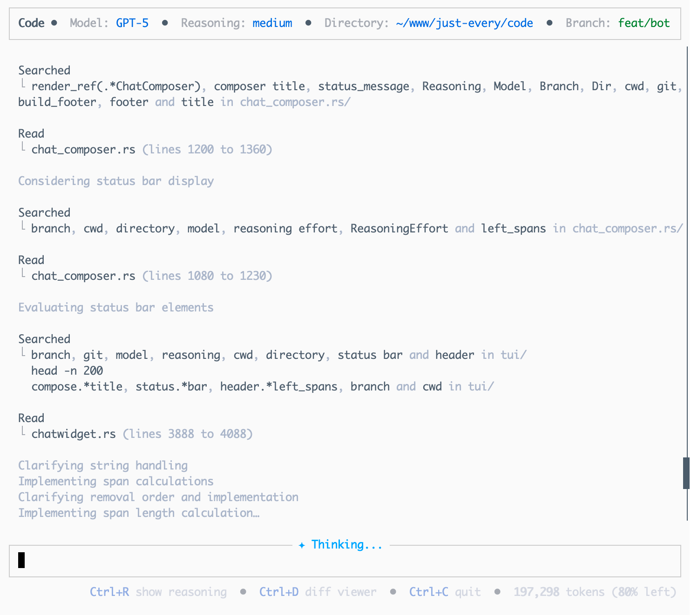
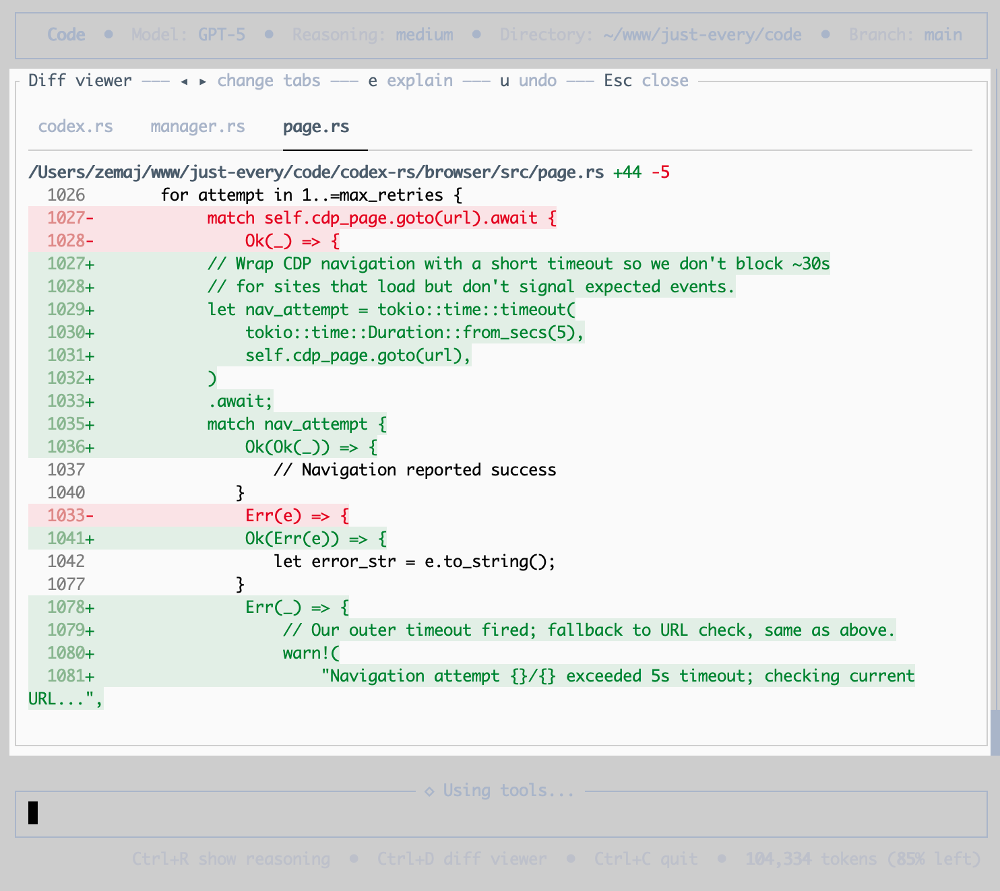
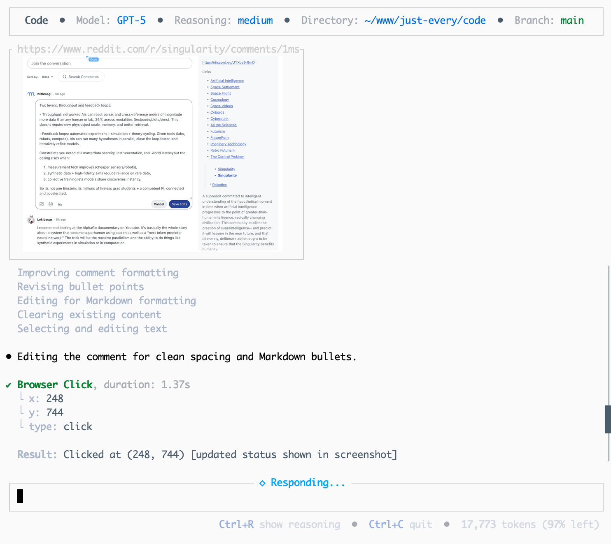
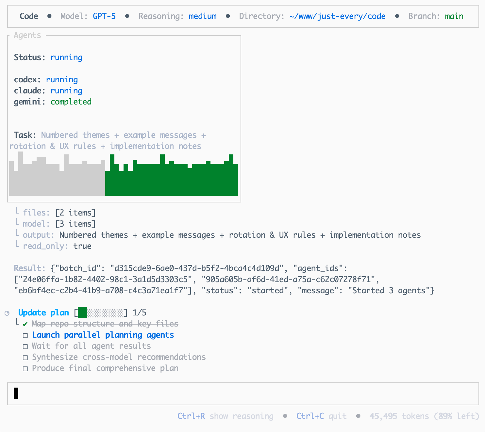

<p align="center">
  
</p>

# Hanzo Dev

Hanzo Dev is our coding agent. It runs in your terminal, reads and edits the
repository you point it at, runs commands in a sandbox, and drives a browser
when a task needs one. Models are served by [Hanzo AI](https://hanzo.ai) —
`enso` and the `zen5` family — over the metered gateway at `api.hanzo.ai`.

It ships inside the Hanzo CLI. `hanzo dev` is the command.

| <br>A session in progress | <br>Reviewing a diff |
|:--:|:--:|
| <br>Driving a browser | <br>Several agents on one task |

## Install

```bash
curl -fsSL https://hanzo.sh | sh
hanzo auth login
```

`hanzo auth login` signs you in through Hanzo IAM and links the machine to your
account. Then, from any repository:

```bash
hanzo dev
```

Give it the task on the command line to run headless instead:

```bash
hanzo dev "fix the failing tests in ./core and explain what was wrong"
```

## Choosing a model

Model ids come from the gateway, which is the only authority on the catalog —
there is no allowlist in the client.

```bash
hanzo dev --model enso          # our frontier model
hanzo dev --model enso-ultra    # the largest reasoning tier
hanzo dev --model zen5-coder    # tuned for code
```

Browse everything available with `curl https://catalog.hanzo.ai/v1/models`.

## Backends

Hanzo Dev is the default and the one we build. The same session launcher can
also drive two other agents if you already have them installed, so you can keep
one set of habits across all three:

```bash
hanzo dev              # our agent (default)
hanzo dev claude       # or: hanzo code --claude
hanzo dev codex        # or: hanzo code --codex
```

`hanzo dev` is a spelling of `hanzo code dev`, not a second implementation —
every spelling resolves through the same launcher.

## Options

```
hanzo dev [OPTIONS] [BACKEND|TASK] [TASK] [-- <PASSTHROUGH>...]

  --model <MODEL>     Gateway model id, e.g. enso, enso-ultra, zen5-coder
  --backend <NAME>    dev (default) | claude | codex
  --brand <BRAND>     Tenant for auth: hanzo | lux | zoo | pars | bootnode
  --ask               Ask before each action instead of auto-approving (alias: --safe)
  --no-sandbox        Drop the sandbox and auto-approve. Per-invocation, never persisted
  --no-route          Call the backend's own model account instead of the metered gateway
  --no-mcp            Do not attach the Hanzo MCP toolset
  --project-mcp       Also load the repo's own .mcp.json servers (off by default — a repo is untrusted)
  --link / --no-link  Stream the session to Hanzo cloud, or never
  --resume <ID>       Resume a prior linked session by its cloud session id
  -c, --config <FILE> Use a specific config file
  -v, --verbose       Increase logging verbosity
```

Anything after `--` is passed verbatim to the backend.

Two defaults worth knowing. Sessions run sandboxed and auto-approve inside that
sandbox; `--ask` tightens it, `--no-sandbox` removes it. Model calls route
through `api.hanzo.ai` so usage is metered on your Hanzo account; `--no-route`
sends them to the backend's own account instead.

## In a session

Type `/` for the full list. The ones you will reach for:

```
/plan       create a comprehensive plan (multiple agents)
/solve      solve a challenging problem (multiple agents)
/code       perform a coding task (multiple agents)
/auto       work autonomously on long tasks with Auto Drive
/agents     create and configure agents
/browser    open the internal browser
/chrome     connect to a running Chrome over CDP
/diff       show the git diff, including untracked files
/review     review your changes for potential issues
/undo       restore the workspace to the last snapshot
/branch     work on a branch in a worktree
/merge      merge the worktree branch back to the default
/model      choose model and reasoning effort
/reasoning  change reasoning effort (minimal/low/medium/high)
/theme      switch color themes
/status     session configuration and token usage
/limits     weekly and hourly rate limits
/mcp        manage MCP servers (status/on/off/add)
/init       write an AGENTS.md for this repository
/resume     resume a past session for this folder
/new        start a new chat
```

Full list with descriptions: [docs/slash-commands.md](docs/slash-commands.md).

## Project context

Run `/init` in a repository and Hanzo Dev writes an `AGENTS.md` describing what
it found. Edit that file — it is read at the start of every session in that
directory, so it is where project conventions, architecture notes and "do not
touch this" rules belong.

## Tools

The Hanzo MCP toolset is attached by default: filesystem, shell, browser, and
the rest of the Hanzo surface. Add your own servers with `/mcp add`, or per
repository in `.mcp.json` — the latter is off unless you pass `--project-mcp`,
because a repository you just cloned should not get to run a server with your
session's key.

## Documentation

- [Getting started](docs/getting-started.md)
- [Configuration](docs/config.md)
- [Authentication](docs/authentication.md)
- [Sandboxing](docs/sandbox.md)
- [Themes](docs/THEME_CONFIG.md)
- [Hanzo docs](https://docs.hanzo.ai/docs)

## Building from source

```bash
git clone https://github.com/hanzoai/dev.git
cd dev
./build-fast.sh
```

`./build-fast.sh` is the required check — it must pass cleanly, warnings
included. See [DEVELOPING.md](DEVELOPING.md) and [LLM.md](LLM.md) for the
workspace layout and the rules that apply inside it.

## Contributing

Branch, make the change, make `./build-fast.sh` pass, open a pull request.
Bugs and feature requests: [github.com/hanzoai/dev/issues](https://github.com/hanzoai/dev/issues).

## License

Apache-2.0 — see [LICENSE](LICENSE).

## Lineage

Hanzo Dev is a fork of [just-every/code](https://github.com/just-every/code), which is
itself a fork of [openai/codex](https://github.com/openai/codex). Both are Apache-2.0,
and this repository preserves the upstream `LICENSE` and `NOTICE`. Hanzo Dev is not
affiliated with, sponsored by, or endorsed by either project.
