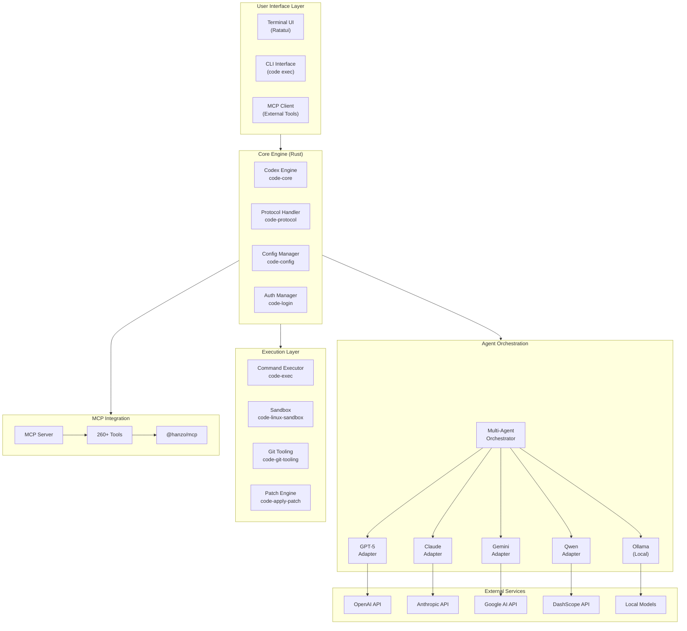
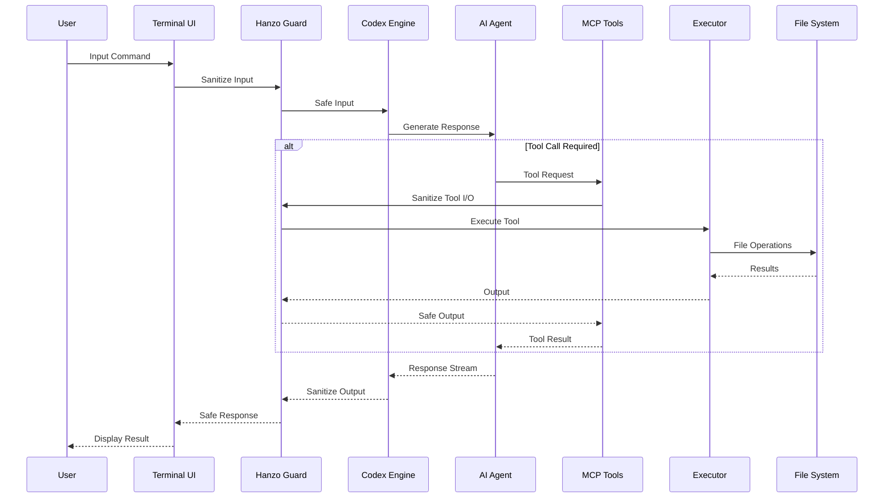
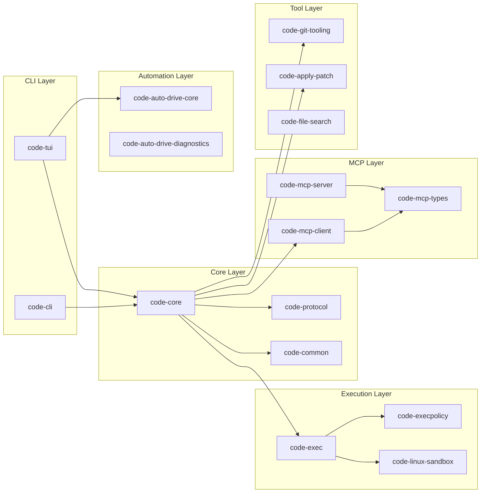
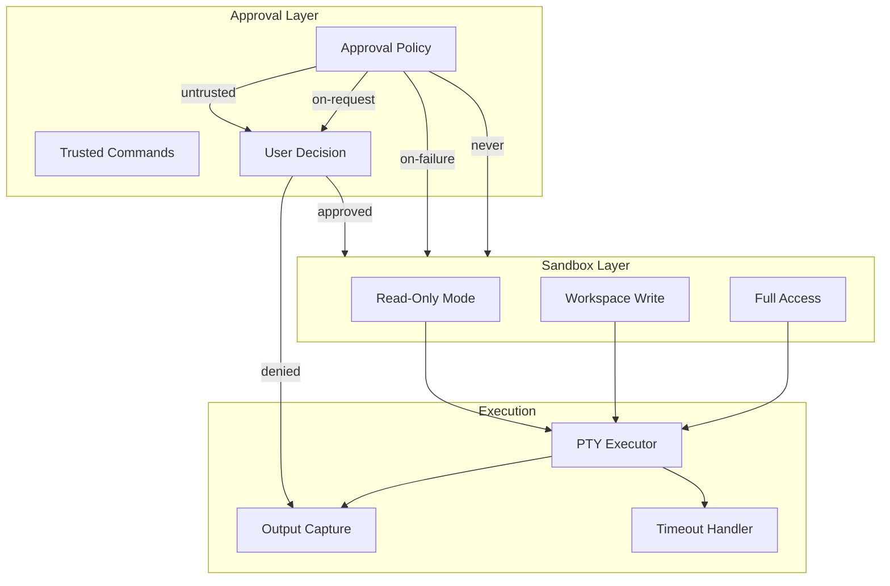
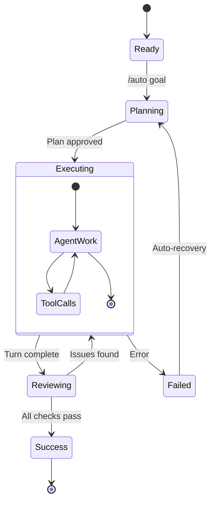
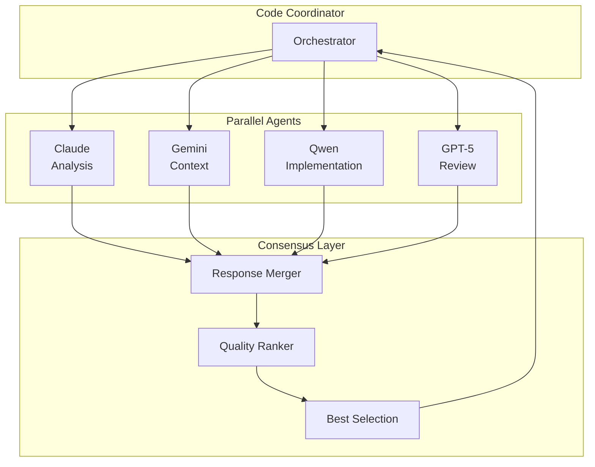
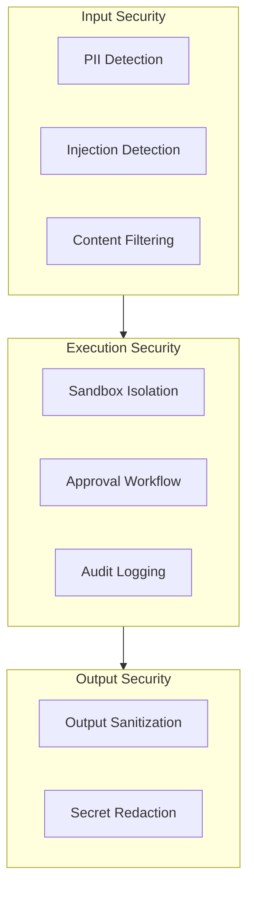

# Hanzo Dev Platform

> The Ultimate AI-Powered Development Environment

**Hanzo Dev** is a high-performance, multi-agent AI coding assistant that brings the power of frontier language models directly to your terminal. Built on a Rust foundation for speed and reliability, it orchestrates multiple AI providers, supports autonomous workflows, and integrates seamlessly with the Model Context Protocol (MCP) ecosystem.

---

## Table of Contents

1. [Architecture Overview](#architecture-overview)
2. [Getting Started](#getting-started)
3. [Core Components](#core-components)
4. [Configuration Reference](#configuration-reference)
5. [API Reference](#api-reference)
6. [Deployment Guide](#deployment-guide)
7. [Advanced Topics](#advanced-topics)
8. [Contributing](#contributing)

---

## Architecture Overview

### High-Level System Architecture



### Data Flow Architecture



### Component Dependency Graph



---

## Getting Started

### Prerequisites

- **Node.js** >= 22.0.0
- **Rust** >= 2024 edition (for building from source)
- **pnpm** >= 9.0.0 (recommended package manager)
- One or more AI provider API keys

### Quick Installation

```bash
# NPX (fastest - no install required)
npx -y @just-every/code

# Global Installation
npm install -g @just-every/code

# Run the CLI
code  # or 'coder' if 'code' conflicts with VS Code
```

### Authentication

Choose your authentication method:

```bash
# Option 1: Sign in with ChatGPT (Plus/Pro/Team)
code  # Select "Sign in with ChatGPT" at prompt

# Option 2: API Key (usage-based)
export OPENAI_API_KEY=sk-...
code

# Option 3: Multiple Providers
export ANTHROPIC_API_KEY=sk-ant-...
export GOOGLE_API_KEY=...
export DASHSCOPE_API_KEY=...
```

### First Commands

```bash
# Interactive mode
code

# With initial prompt
code "explain this codebase to me"

# Non-interactive automation
code exec "run tests and fix failures"

# Full autonomous mode
code --full-auto "create the fanciest todo-list app"
```

### Install Additional AI Assistants

```bash
# Install companion CLIs for multi-agent workflows
npm install -g @anthropic-ai/claude-code @google/gemini-cli @qwen-code/qwen-code

# Verify installations
claude --version
gemini --version
qwen --version
```

---

## Core Components

### 1. Codex Engine (`code-core`)

The heart of Hanzo Dev - handles conversation management, model communication, and tool orchestration.

```
code-rs/core/
├── src/
│   ├── lib.rs              # Main library exports
│   ├── codex.rs            # Core Codex engine
│   ├── client.rs           # Model client abstraction
│   ├── config.rs           # Configuration management
│   ├── auth.rs             # Authentication handlers
│   ├── exec/               # Command execution
│   ├── mcp_connection_manager.rs  # MCP integration
│   ├── slash_commands.rs   # Slash command handlers
│   └── agent_tool.rs       # Agent orchestration
```

**Key Capabilities:**
- Multi-model conversation management
- Streaming response handling
- Token usage tracking and rate limiting
- Context window optimization
- Session persistence and resume

### 2. Terminal UI (`code-tui`)

A rich terminal interface built with Ratatui providing an IDE-like experience.

```
code-rs/tui/
├── src/
│   ├── app.rs              # Application state
│   ├── chatwidget.rs       # Main chat interface
│   ├── history_cell.rs     # Message rendering
│   ├── composer.rs         # Input composer
│   ├── bottom_pane/        # Settings, agents, MCP panels
│   ├── slash_command.rs    # Slash command UI
│   └── theme.rs            # Theming system
```

**Features:**
- Real-time streaming with syntax highlighting
- Fuzzy file search with `@` mention
- Image paste support (Ctrl+V / Cmd+V)
- Theme customization
- Keyboard-driven navigation

### 3. Protocol Layer (`code-protocol`)

Defines the communication protocol between client and agent using SQ/EQ pattern.

```rust
// Submission Queue Entry - requests from user
pub struct Submission {
    pub id: String,
    pub op: Op,
}

pub enum Op {
    Interrupt,
    UserInput { items: Vec<InputItem>, ... },
    UserTurn { items: Vec<InputItem>, cwd: PathBuf, ... },
    ExecApproval { id: String, decision: ReviewDecision },
    PatchApproval { id: String, decision: ReviewDecision },
    // ... 20+ operation types
}

// Event Queue Entry - events from agent
pub struct Event {
    pub id: String,
    pub event_seq: u64,
    pub msg: EventMsg,
}

pub enum EventMsg {
    TaskStarted(TaskStartedEvent),
    AgentMessage(AgentMessageEvent),
    AgentMessageDelta(AgentMessageDeltaEvent),
    ExecCommandBegin(ExecCommandBeginEvent),
    ExecCommandEnd(ExecCommandEndEvent),
    // ... 40+ event types
}
```

### 4. Execution Engine (`code-exec`)

Secure command execution with sandboxing and approval workflows.



**Sandbox Policies:**

| Policy | Description | Use Case |
|--------|-------------|----------|
| `read-only` | No file modifications | Code review, analysis |
| `workspace-write` | Write only to CWD + TMPDIR | Safe development |
| `danger-full-access` | No restrictions | Trusted automation |

### 5. Auto Drive (`code-auto-drive-core`)

Autonomous multi-step task execution with self-healing capabilities.



**Configuration:**

```toml
[auto_drive]
review_enabled = true
agents_enabled = true
qa_automation_enabled = true
cross_check_enabled = true
observer_enabled = true
continue_mode = "ten-seconds"  # immediate | ten-seconds | sixty-seconds | manual
model = "gpt-5.1"
model_reasoning_effort = "high"
auto_resolve_review_attempts = 5
```

### 6. MCP Integration

Full Model Context Protocol support for tool extensibility.

```
code-rs/
├── mcp-client/      # MCP client implementation
├── mcp-server/      # MCP server for external tools
├── mcp-types/       # Shared type definitions
└── rmcp-client/     # Rust MCP client
```

**Configuring MCP Servers:**

```toml
[mcp-servers.filesystem]
command = "npx"
args = ["-y", "@modelcontextprotocol/server-filesystem", "/path/to/project"]

[mcp-servers.docker]
command = "npx"
args = ["-y", "@modelcontextprotocol/server-docker"]

[mcp-servers.custom]
command = "/usr/local/bin/my-mcp-server"
env = { API_KEY = "secret" }
```

---

## Configuration Reference

### Configuration File Location

```
~/.code/config.toml    # Primary (write location)
~/.codex/config.toml   # Legacy (read-only fallback)
~/.hanzo/dev.yaml      # Extended configuration
```

### Core Configuration

```toml
# Model Settings
model = "gpt-5.1"
model_provider = "openai"  # openai | anthropic | google | dashscope | ollama

# Behavior
approval_policy = "on-request"  # untrusted | on-failure | on-request | never
model_reasoning_effort = "medium"  # minimal | low | medium | high
sandbox_mode = "workspace-write"

# UI Preferences
[tui.theme]
name = "light-photon"

# History
[history]
persistence = "save-all"
max-bytes = 10485760  # 10MB
```

### Agent Configuration

```toml
[[agents]]
name = "claude"
command = "claude"
enabled = true
read-only = false
description = "Claude AI assistant"
args = ["--dangerously-skip-permissions"]

[[agents]]
name = "gemini"
command = "gemini"
enabled = true
read-only = false
args = ["-y"]

[[agents]]
name = "qwen"
command = "qwen"
enabled = true
read-only = false
args = ["-y"]
```

### Subagent Commands

```toml
[subagents]

[[subagents.commands]]
name = "plan"
read-only = true
agents = ["claude", "gemini", "qwen"]
orchestrator-instructions = "Focus on discovering project layout and risks."
agent-instructions = "Summarize assumptions explicitly. Cite files you read."

[[subagents.commands]]
name = "solve"
read-only = true
agents = ["claude", "gemini", "qwen"]
orchestrator-instructions = "Run multiple approaches in parallel and compare."
agent-instructions = "Propose a concrete fix with steps to validate."

[[subagents.commands]]
name = "code"
read-only = false
agents = ["claude", "gemini", "qwen"]
orchestrator-instructions = "Coordinate implementations across agents."
agent-instructions = "Write minimal, focused changes with clear rationale."
```

### Environment Variables

| Variable | Description | Default |
|----------|-------------|---------|
| `CODE_HOME` | Config directory override | `~/.code` |
| `OPENAI_API_KEY` | OpenAI API key | - |
| `OPENAI_BASE_URL` | Custom OpenAI-compatible endpoint | - |
| `OPENAI_WIRE_API` | Force `chat` or `responses` API | auto |
| `ANTHROPIC_API_KEY` | Anthropic API key | - |
| `GOOGLE_API_KEY` | Google AI API key | - |
| `DASHSCOPE_API_KEY` | Alibaba DashScope API key | - |
| `CODE_ENABLE_CLOUD_AGENT_MODEL` | Enable cloud agent variants | false |

---

## API Reference

### Protocol Operations (Op)

| Operation | Description | Response Event |
|-----------|-------------|----------------|
| `Interrupt` | Abort current task | `TurnAborted` |
| `UserInput` | Send user message | `AgentMessage*` |
| `UserTurn` | Full turn with context | `AgentMessage*` |
| `ExecApproval` | Approve/deny command | `ExecCommandEnd` |
| `PatchApproval` | Approve/deny patch | `PatchApplyEnd` |
| `ListMcpTools` | List available MCP tools | `McpListToolsResponse` |
| `ListSkills` | List available skills | `ListSkillsResponse` |
| `Compact` | Summarize conversation | `AgentMessage` |
| `Review` | Request code review | `ReviewOutput` |
| `Shutdown` | Graceful shutdown | `ShutdownComplete` |

### Event Types (EventMsg)

**Lifecycle Events:**
- `TaskStarted` - Agent began processing
- `TaskComplete` - Agent finished all actions
- `SessionConfigured` - Session initialized
- `ShutdownComplete` - Clean shutdown

**Message Events:**
- `AgentMessage` - Complete agent response
- `AgentMessageDelta` - Streaming response chunk
- `AgentReasoning` - Reasoning output
- `UserMessage` - Echo of user input

**Execution Events:**
- `ExecCommandBegin` - Command starting
- `ExecCommandOutputDelta` - Streaming command output
- `ExecCommandEnd` - Command completed
- `ExecApprovalRequest` - Approval needed

**Patch Events:**
- `PatchApplyBegin` - Patch starting
- `PatchApplyEnd` - Patch completed
- `ApplyPatchApprovalRequest` - Patch approval needed

**MCP Events:**
- `McpToolCallBegin` - Tool call starting
- `McpToolCallEnd` - Tool call completed
- `McpListToolsResponse` - Available tools list

### Slash Commands

| Command | Description | Example |
|---------|-------------|---------|
| `/new` | Start new conversation | `/new` |
| `/resume` | Resume past session | `/resume` |
| `/auto [goal]` | Start Auto Drive | `/auto refactor auth` |
| `/plan <task>` | Multi-agent planning | `/plan new feature` |
| `/solve <problem>` | Multi-agent problem solving | `/solve this bug` |
| `/code <task>` | Multi-agent coding | `/code add tests` |
| `/review [focus]` | Code review | `/review security` |
| `/diff` | Show git diff | `/diff` |
| `/undo` | Restore previous state | `/undo` |
| `/settings` | Open settings panel | `/settings model` |
| `/model` | Change model | `/model` |
| `/reasoning` | Change reasoning level | `/reasoning high` |
| `/theme` | Change theme | `/theme` |
| `/mcp` | Manage MCP servers | `/mcp status` |

---

## Deployment Guide

### Local Development

```bash
# Clone repository
git clone https://github.com/hanzoai/dev.git
cd dev

# Install dependencies
pnpm install

# Fast development build
./build-fast.sh

# Run locally
./code-rs/target/dev-fast/code
```

### Production Build

```bash
# Full release build with LTO
cd code-rs && cargo build --release

# Binaries located at:
# ./code-rs/target/release/code
# ./code-rs/target/release/code-tui
# ./code-rs/target/release/code-exec
```

### Docker Deployment

```dockerfile
FROM rust:1.82-slim as builder
WORKDIR /app
COPY . .
RUN cargo build --release --bin code

FROM debian:bookworm-slim
COPY --from=builder /app/target/release/code /usr/local/bin/
ENV OPENAI_API_KEY=""
ENTRYPOINT ["code"]
```

### NPM Package Distribution

The `hanzo-node` package provides npm distribution:

```bash
# Global installation
npm install -g hanzo-node

# Usage
hanzo "your prompt"
hanzo-dev --help
```

**Platform packages:**
- `hanzo-node-darwin-arm64` - macOS Apple Silicon
- `hanzo-node-darwin-x64` - macOS Intel
- `hanzo-node-linux-x64-musl` - Linux x64
- `hanzo-node-linux-arm64-musl` - Linux ARM64
- `hanzo-node-win32-x64` - Windows x64

### CI/CD Integration

```yaml
# GitHub Actions example
name: CI
on: [push, pull_request]
jobs:
  test:
    runs-on: ubuntu-latest
    steps:
      - uses: actions/checkout@v4
      - uses: dtolnay/rust-toolchain@stable
      - run: ./build-fast.sh
      - run: cargo test --all

  release:
    needs: test
    runs-on: ubuntu-latest
    if: github.ref == 'refs/heads/main'
    steps:
      - uses: actions/checkout@v4
      - run: cargo build --release
      - uses: actions/upload-artifact@v4
        with:
          name: hanzo-dev
          path: target/release/code
```

---

## Advanced Topics

### Multi-Agent Workflows

Hanzo Dev supports sophisticated multi-agent orchestration:



### Security Model



### Performance Optimization

**Token Management:**
- Automatic context compaction when approaching limits
- Cached input token tracking
- Reasoning token separation

**Streaming:**
- Real-time delta streaming for responsive UI
- Buffered command output
- Async event processing

**Build Profiles:**

| Profile | Use Case | Optimization |
|---------|----------|--------------|
| `dev` | Development | Incremental |
| `dev-fast` | Fast iteration | opt-level=1 |
| `perf` | Profiling | debug symbols |
| `release` | Production | LTO + strip |

### Extending with MCP Tools

Create custom MCP servers to extend Hanzo Dev:

```typescript
import { Server } from "@modelcontextprotocol/sdk/server/index.js";

const server = new Server({
  name: "my-custom-tools",
  version: "1.0.0",
}, {
  capabilities: { tools: {} }
});

server.setRequestHandler("tools/list", async () => ({
  tools: [{
    name: "my_tool",
    description: "Does something useful",
    inputSchema: {
      type: "object",
      properties: {
        input: { type: "string" }
      }
    }
  }]
}));

server.setRequestHandler("tools/call", async (request) => {
  if (request.params.name === "my_tool") {
    return { content: [{ type: "text", text: "Result" }] };
  }
});
```

---

## Contributing

### Development Workflow

1. Fork the repository
2. Create a feature branch: `git checkout -b feature/amazing-feature`
3. Make changes and test: `./build-fast.sh`
4. Run tests: `cargo test --all`
5. Submit a pull request

### Code Standards

- Rust 2024 edition
- `clippy::unwrap_used = "deny"` - No unwrap in production
- `clippy::expect_used = "deny"` - No expect in production
- All warnings must be fixed
- Test coverage for new features

### Git Hooks

```bash
# Enable shared hooks
git config core.hooksPath .githooks
```

### Documentation

- Update relevant docs with code changes
- Keep AGENTS.md files current
- Add examples for new features

---

## Resources

- **Repository:** https://github.com/hanzoai/dev
- **Organization:** https://github.com/hanzoai
- **Company:** https://hanzo.ai (Techstars '17)
- **Upstream:** https://github.com/openai/codex

---

## License

Apache 2.0 - See [LICENSE](../LICENSE) for details.

Hanzo Dev is a community fork of the original Codex CLI, maintaining compatibility while adding enterprise features requested by the developer community.

---

*Built with love by [Hanzo AI](https://hanzo.ai) - Frontier AI for Developers*
